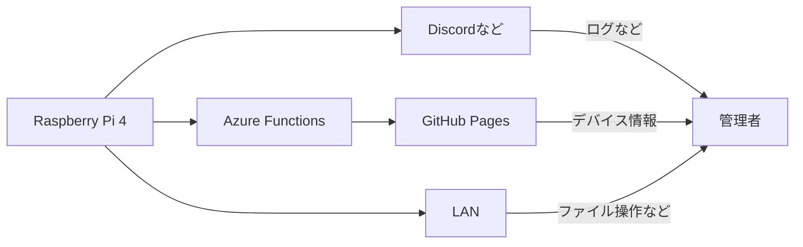

# pi-infra-core

自宅サーバーのコア機能を支えるコード

## `core`

サーバー上で稼働するコード

## `docs`

GitHub Pages で公開するための Web フロントエンド

## `api-front`

Web フロントエンドからサーバー情報を取得するための API

## `gateway`

サーバーからクラウドに対してデバイス情報を送信するための API

## コミットプレフィックス

- `feature`：新しい機能の追加
- `fix`：不具合の修正
- `docs`：ドキュメントやコメントの変更
- `style`：フォーマットの変更
- `refactor`：コードの整理
- `optimize`：アルゴリズムの最適化
- `test`：テストなどの整備
- `init`：初期コミットなど
- `chore`：その他
